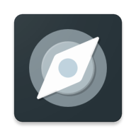

# DepNav – Department Navigator

**DepNav** is an Android application for viewing indoor maps of departments and searching for
specific rooms on them.

The following maps are available:

- Mathematics and Mechanics Faculty, St. Petersburg State University

|  |  |
|:---------------------------------------------------------------------------------------------------------------------------------------------------------------------------------------------------------------------------------------------------------------------------------------------------------------------------------------------------:|:--------------------------------------------------------------------------------------------------------------------------------------------------------------------------------------------------------------------------------------------------------------------------------------------------------------------------:|

## Features

With **DepNav** you can do the following:

- **View** the available maps by floors
- **Search** for specific rooms and other objects on the selected map with built-in search
- Enjoy Material UI 3 in selectable light and dark themes
- Two languages available: English and Russian

|  |  |  |
|:---------------------------------------:|:------------------------------------------:|:----------------------------------------:|

## Get it!

The following download sources are available:

- [Google Play](https://play.google.com/store/apps/details?id=ru.spbu.depnav&utm_source=https%3A%2F%2Fgithub.com%2FTimPushkin%2FDepNav)
  or [AppGallery](https://appgallery.cloud.huawei.com/ag/n/app/C106717783?channelId=GitHub+repository&id=05d3f9cea9c44d829cd43b9f79593c88&s=A358D75497B3480E158A47713DE08E03B4047FD6FD5F2DA45C7AF9D9B5410F64&detailType=0&v=&callType=AGDLINK&installType=0000)
  (**recommended**) – install DepNav from app stores and receive its updates automatically

- [APK](https://github.com/TimPushkin/DepNav/releases) – download, install, and update DepNav manually

Android 5.0 or newer required.
